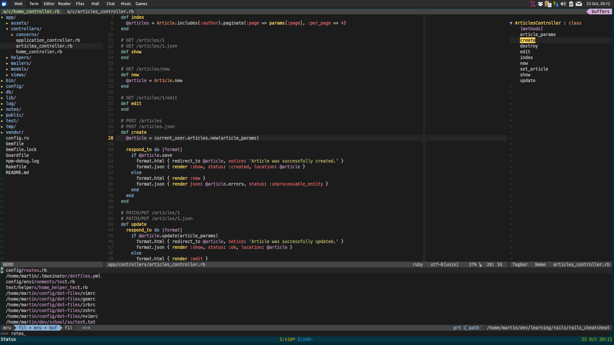

### This repo contains personal, opiniated Ruby/Rails centric dotfiles.

#### What's included:

* Vim (Neovim)
* Ruby CLI utilities (pry, gem, irb)
* ZSH (also bash is included as it was my first shell of choice)
* Tmux
* Git
* XTerm

#### .vimrc

#### .zshrc

ZSH config overview here!

#### .tmux.conf

Tmux config overview here!

#### .Xresources

Xterm overview here!

#### Ruby tools (pry, gem, irb)

Ruby CLI tools configs overview here!
