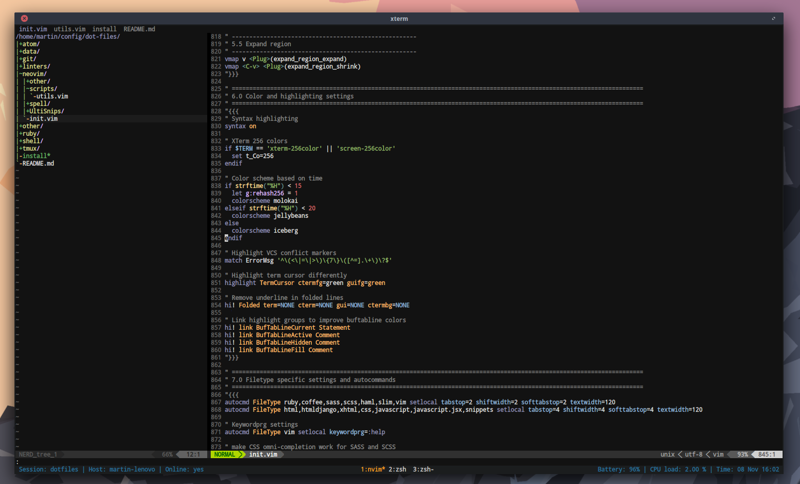

# Well documented, terminal centric web developer's dot files.

Hey everybody. I am Martin, a software developer with an obsession for workflow improvement.
Below I present the most interesting parts of my config files. **Feel free to be inspired**.

**Caution**: This repository is changing often as my workflow is changing (and hopefully improving).

| [Credits](#credits) | [License](#license) |

## What's included?

* [Neovim](#neovim)
* [ZSH](#zsh)
* [Tmux](#tmux)
* [Git](#git)
* [Xterm](#xterm)
* [Ruby / Rails utilities (pry, gem, IRB)](#pry-gem-irb)
* [Other utilities (Ag search, Devilspie2)](#ag-devilspie2)

## Neovim

I am using [Neovim](http://neovim.org/) which is a **Vim** fork focused on maintainability.
Below are the most interesting parts of my Neovim configuration.

### Show me the end result first!

Here you go.



Want more? Scroll down to the appropriate [section](#screenshots-and-cheatsheets).

### Plugins

I use the excellent [vim-plug](https://github.com/junegunn/vim-plug) package manager.
It supports parallel fetching, lazy loading, after install hooks, etc. You should consider using it :)

And which plugins I use? Currently I use about **60** plugins. Some of the most interesting
while probably not so widely known are:

* [Neomake](https://github.com/benekastah/neomake) - Linter integration (Syntastic alternative) with asynchronous support.
* [Unite](https://github.com/Shougo/unite.vim) - Search and display information from arbitrary sources.
* [Multiple cursors](https://github.com/terryma/vim-multiple-cursors) - ST inspired multiple cursors.
* [Isolate](https://github.com/ferranpm/vim-isolate) - Safely edit in isolation.
* [Lexima](https://github.com/cohama/lexima.vim) - Auto-closing (,",' and some language constructs (ruby blocks). Dot repeat supported.

For a complete list, look [here](https://github.com/martin-svk/dot-files/blob/master/neovim/init.vim#L17).

### Utility scripts

In the code snippets below I ofter call `utils#xxx()` functions. Those are just simple multiple lines long
vimscript functions (often inspired by other people). You can find them [here](./neovim/scripts/utils.vim).

### Vim defaults overriding (improving)

```VimL
" Intelligent window cycling
nmap <silent> <C-w><C-w> :call utils#intelligentCycling()<CR>

" Visual linewise up and down by default (and use gj gk to go quicker)
noremap j gj
noremap k gk
nnoremap gj 5j
nnoremap gk 5k

" More useful enter and backspace
nnoremap <CR> G
nnoremap <BS> gg

" When jump to next match also center screen
noremap n nzz
noremap N Nzz

" Same when moving up and down
noremap <C-d> <C-d>zz
noremap <C-u> <C-u>zz

" Remap H and L (top, bottom of screen to left and right end of line)
nnoremap H ^
nnoremap L $
vnoremap H ^
vnoremap L g_

" More logical Y (defaul was alias for yy)
nnoremap Y y$

" Quick replay q macro
nnoremap Q @q

" Cancel terminal mode with ,escape
tnoremap ,<ESC> <C-\><C-n>

" Omni-complete based on ctags
inoremap <C-x><C-]> <C-]>

" Don't yank to default register when changing something
nnoremap c "xc
xnoremap c "xc

" After block yank and paste, move cursor to the end of operated text
" Also, don't copy over-pasted text in visual mode
vnoremap y y`]
vnoremap p "_dP`]
nnoremap p p`]

" No more accidentally showing up command window (Use C-f to show it)
map q: :q
```

### Common tasks

```VimL
" Quick save and close buffer
nnoremap ,w :w<CR>
nnoremap <silent> ,c :Sayonara!<CR>
nnoremap <silent> ,q :Sayonara<CR>

" Yank and paste from clipboard
nnoremap ,y "+y
vnoremap ,y "+y
nnoremap ,yy "+yy
nnoremap ,p "+p

" Move visual block
vnoremap J :m '>+1<CR>gv=gv
vnoremap K :m '<-2<CR>gv=gv
```

### Buffer management

```VimL
" Windows resizing using arrow keys
nnoremap <silent> <Left> :vertical resize -1<CR>
nnoremap <silent> <Right> :vertical resize +1<CR>
nnoremap <silent> <Up> :resize +1<CR>
nnoremap <silent> <Down> :resize -1<CR>

" Buffers navigation and management
nnoremap <silent> + :bn<CR>
nnoremap <silent> _ :bp<CR>
```

### Autocomplete (Simple tab wrapper + Ctags)

```VimL
" Multipurpose tab key (inspired by Gary Bernhardt)
inoremap <expr> <tab> utils#insertTabWrapper()
inoremap <s-tab> <C-n>

" Ctags settings
set tags+=.tags

" Generate tags definitions
command! GenerateCT :call utils#generateCtags()
command! GenerateJSCT :call utils#generateJSCtags()
command! GenerateRubyCT :call utils#generateRubyCtags()
```

### Browser and fuzzy searcher for multiple sources ([Unite](https://github.com/Shougo/unite.vim))

```VimL
" Matcher settings
call unite#filters#matcher_default#use(['matcher_fuzzy'])
call unite#filters#sorter_default#use(['sorter_rank'])

" Use ag if available
if executable('ag')
  let g:unite_source_grep_command='ag'
  let g:unite_source_grep_default_opts='--nocolor --line-numbers --nogroup -S -C0'
  let g:unite_source_grep_recursive_opt=''

  " Set rec source command
  let g:unite_source_rec_async_command = ['ag', '--follow', '--nocolor', '--nogroup', '--hidden', '-g', '']
endif

" Custom profile
call unite#custom#profile('default', 'context', {
      \   'prompt': '» ',
      \   'winheight': 15,
      \ })

" Add syntax highlighting
let g:unite_source_line_enable_highlight=1
```

##### Custom Unite menu (for when You forgot the shortcuts).

```VimL
" Custom unite menus
let g:unite_source_menu_menus = {}

" Utils menu
let g:unite_source_menu_menus.utils = {
      \     'description' : 'Utility commands',
      \ }
let g:unite_source_menu_menus.utils.command_candidates = [
      \       ['Color picker', 'VCoolor'],
      \       ['Run XMPFilter', 'Annotate'],
      \       ['Format file', 'Format'],
      \       ['Run file', 'Run'],
      \       ['Rename file', 'Rename'],
      \       ['Generate Ctags', 'GenerateCT'],
      \       ['Generate JS Ctags', 'GenerateJSCT'],
      \       ['Generate Ruby/Rails Ctags', 'GenerateRailsCT'],
      \       ['Show notes', 'Notes'],
      \     ]

" Git menu
let g:unite_source_menu_menus.git = {
      \     'description' : 'Git commands',
      \ }
let g:unite_source_menu_menus.git.command_candidates = [
      \       ['Stage hunk', 'GitGutterStageHunk'],
      \       ['Unstage hunk', 'GitGutterRevertHunk'],
      \       ['Stage', 'Gwrite'],
      \       ['Status', 'Gstatus'],
      \       ['Diff', 'Gvdiff'],
      \       ['Commit', 'Gcommit --verbose'],
      \       ['Revert', 'Gread'],
      \       ['Log', 'Glog'],
      \       ['Visual Log', 'Gitv'],
      \     ]

" Plug menu
let g:unite_source_menu_menus.plug = {
      \     'description' : 'Plugin management commands',
      \ }
let g:unite_source_menu_menus.plug.command_candidates = [
      \       ['Install plugins', 'PlugInstall'],
      \       ['Update plugins', 'PlugUpdate'],
      \       ['Clean plugins', 'PlugClean'],
      \       ['Upgrade vim-plug', 'PlugUpgrade'],
      \     ]

" My unite menu
let g:unite_source_menu_menus.unite = {
      \     'description' : 'My Unite sources',
      \ }
let g:unite_source_menu_menus.unite.command_candidates = [
      \       ['Unite MRUs', 'call utils#uniteMRUs()'],
      \       ['Unite buffers', 'call utils#uniteBuffers()'],
      \       ['Unite file search', 'call utils#uniteFileRec()'],
      \       ['Unite grep', 'call utils#uniteGrep()'],
      \       ['Unite history', 'call utils#uniteHistory()'],
      \       ['Unite line search', 'call utils#uniteLineSearch()'],
      \       ['Unite menu', 'call utils#uniteCustomMenu()'],
      \       ['Unite registers', 'call utils#uniteRegisters()'],
      \       ['Unite snippets', 'call utils#uniteSnippets()'],
      \       ['Unite sources', 'call utils#uniteSources()'],
      \       ['Unite symbols', 'call utils#uniteOutline()'],
      \       ['Unite tags', 'call utils#uniteTags()'],
      \       ['Unite windows', 'call utils#uniteWindows()'],
      \       ['Unite yank history', 'call utils#uniteYankHistory()'],
      \     ]
```

##### Unite buffer mappings

```VimL
" Custom mappings for the unite buffer
autocmd FileType unite call s:unite_settings()
function! s:unite_settings()
  " Enable navigation with control-j and control-k in insert mode
  imap <silent> <buffer> <C-j> <Plug>(unite_select_next_line)
  imap <silent> <buffer> <C-k> <Plug>(unite_select_previous_line)
  " Runs 'splits' action by <C-s> and <C-v>
  imap <silent> <buffer> <expr> <C-s> unite#do_action('split')
  imap <silent> <buffer> <expr> <C-v> unite#do_action('vsplit')
  " Exit with escape
  nmap <silent> <buffer> <ESC> <Plug>(unite_exit)
  " Mark candidates
  vmap <silent> <buffer> m <Plug>(unite_toggle_mark_selected_candidates)
  nmap <silent> <buffer> m <Plug>(unite_toggle_mark_current_candidate)
endfunction
```

### Improved status line ([Lightline](https://github.com/itchyny/lightline.vim))

```VimL
let g:lightline = {
      \ 'colorscheme': 'powerline',
      \ 'tab': {
      \   'active': [ 'tabnum', 'filename', 'modified' ],
      \   'inactive': [ 'tabnum', 'filename', 'modified' ]
      \ },
      \ 'active': {
      \   'left': [ [ 'mode', 'paste', 'capslock' ],
      \             [ 'readonly', 'filename', 'modified' ] ]
      \ },
      \ 'component': {
      \   'readonly': '%{&filetype=="help"?"":&readonly?"⭤":""}',
      \   'modified': '%{&filetype=="help"?"":&modified?"+":&modifiable?"":"-"}',
      \   'capslock': '%{exists("*CapsLockStatusline")?CapsLockStatusline():""}'
      \ },
      \ 'component_visible_condition': {
      \   'readonly': '(&filetype!="help"&& &readonly)',
      \   'modified': '(&filetype!="help"&&(&modified||!&modifiable))'
      \ },
      \ 'separator': { 'left': '', 'right': '' },
      \ 'subseparator': { 'left': '', 'right': '' }
      \ }
```

### Snippets support ([Ultisnips](https://github.com/SirVer/ultisnips))

```VimL
" Disable built-in cx-ck to be able to go backward
inoremap <C-x><C-k> <nop>
let g:UltiSnipsExpandTrigger='<C-j>'
let g:UltiSnipsListSnippets='<C-l>'
let g:UltiSnipsJumpForwardTrigger='<C-j>'
let g:UltiSnipsJumpBackwardTrigger='<C-k>'
```

### Color settings based on time

```viml
" Syntax highlighting
syntax on

" XTerm 256 colors
if $TERM == 'xterm-256color' || 'screen-256color'
  set t_Co=256
endif

" Color scheme based on time
if strftime("%H") < 15
  let g:rehash256 = 1
  colorscheme molokai
elseif strftime("%H") < 20
  colorscheme jellybeans
else
  colorscheme iceberg
endif

" Highlight VCS conflict markers
match ErrorMsg '^\(<\|=\|>\)\{7\}\([^=].\+\)\?$'

" Highlight term cursor differently
highlight TermCursor ctermfg=green guifg=green

" Remove underline in folded lines
hi! Folded term=NONE cterm=NONE gui=NONE ctermbg=NONE

" Link highlight groups to improve buftabline colors
hi! link BufTabLineCurrent Statement
hi! link BufTabLineActive Comment
hi! link BufTabLineHidden Comment
hi! link BufTabLineFill Comment
```

### Screenshots and Cheatsheets

[Iceberg + ReactJS](./data/screenshots/iceberg_react.png)

[Jellybeans + Unite file search](./data/screenshots/jellybeans_unite_file_search.png)

[Jellybeans + Unite line search](./data/screenshots/jellybeans_unite_line_filter.png)

[Jellybeans + Unite yank history](./data/screenshots/jellybeans_unite_yank_history.png)

[Image cheatsheet](./data/screenshots/cheatsheet.png)

[PDF cheatsheet](./data/screenshots/cheatsheet2.pdf)

## Zsh

My shell interpreter of choice. Here are some options to improve the behavior to my taste.

```zsh
# Disable control flow (ctrl-s / ctrl-q)
stty stop '' -ixoff -ixon

# Set spelling correction
setopt correct

# Dont raise errors when regex nomatch fires
unsetopt nomatch

# Use vman as man wrapper (Needs superman vim plugin)
compdef vman="man"
vman() {
  nvim -c "SuperMan $*"

  if [ "$?" != "0" ]; then
    echo "No manual entry for $*"
  fi
}
```

I am also using the excellent [oh-my-zsh](https://github.com/robbyrussell/oh-my-zsh) framework.

```zsh
# Path to your oh-my-zsh installation.
export ZSH=$HOME/.oh-my-zsh

# Set name of the theme to load.
ZSH_THEME="martinus"

# Disable auto title setting
DISABLE_AUTO_TITLE="true"

# Which plugins would you like to load? (plugins can be found in ~/.oh-my-zsh/plugins/*)
plugins=(adb bgnotify bower bundler common-aliases docker extract gem gitfast gulp heroku httpie jsontools meteor mix
         npm rails rbenv redis-cli rsync tmux tmuxinator vagrant zsh-syntax-highlighting)

source $ZSH/oh-my-zsh.sh
source $ZSH/plugins/history-substring-search/history-substring-search.zsh

# History substring search plugin binding
bindkey '^[[A' history-substring-search-up
bindkey '^[[B' history-substring-search-down
```

## Tmux

I am a heavy user of tmux. I am using the [tpm](https://github.com/tmux-plugins/tpm) package manager
and mainly it's [tmux ressurect](https://github.com/tmux-plugins/tmux-resurrect) plugin which allows me
to persist sessions on the disk.

I am also using the [tmuxinator](https://github.com/tmuxinator/tmuxinator) gem to
quickly bootstrap new tmux sessions. Below are the most interesting settings in my tmux config file:

### Settings

```zsh
# Unset ruby version so it respects .ruby-version files
set-environment -gu RBENV_VERSION

# UTF-8 settings
set -g status-utf8 on
set -g utf8 on

# Fastest command sequences (http://superuser.com/a/252717/65504)
set -s escape-time 0

# For nice colors
set -g default-terminal "screen-256color"

# XTerm compatibility
set -g xterm-keys on

# Vi keys in copy mode
set -g mode-keys vi

# History boost
set -g history-limit 50000

# Enable mouse
set -g mode-mouse on
set -g mouse-select-pane on
set -g mouse-resize-pane on
set -g mouse-select-window on

# Emacs key bindings in command prompt (prefix + :) are better than vi keys, even for vim users
set -g status-keys emacs

# Focus events enabled for terminals that support them
set -g focus-events on

# Super useful when using "grouped sessions" and multi-monitor setup
setw -g aggressive-resize on

# Messages are displayed for 3 seconds
set -g display-time 3000
```

### Key bindings

```zsh
# Backtick as Prefix
unbind C-b
set -g prefix `
bind-key ` send-prefix

# Reload the file with Prefix r
bind R source-file ~/.tmux.conf \; display "Sourced tmux.conf"

# Next and prev window like in vim
bind -r - previous-window
bind -r = next-window

# New windows and panes in the same dir
bind-key n new-window -c "#{pane_current_path}"
bind-key i split-window -h -c "#{pane_current_path}"
bind-key v split-window -c "#{pane_current_path}"

# Pane switching
bind-key h select-pane -L
bind-key j select-pane -D
bind-key k select-pane -U
bind-key l select-pane -R
bind-key \ select-pane -l

# Resize panes with arrows
bind-key -r Left resize-pane -L 1
bind-key -r Down resize-pane -D 1
bind-key -r Up resize-pane -U 1
bind-key -r Right resize-pane -R 1

# <prefix> r to rename window
bind-key r command-prompt 'rename-window %%'

# <prefix> p to paste buffer
unbind p
bind p paste-buffer

# <prefix> P to choose which buffer to paste
bind P choose-buffer
```

### Plugins

```zsh
# List of plugins
set -g @plugin 'tmux-plugins/tpm'
set -g @plugin 'tmux-plugins/tmux-yank' # yanking helpers
set -g @plugin 'tmux-plugins/tmux-sessionist' # session helpers prexif + C (new session)
set -g @plugin 'tmux-plugins/tmux-resurrect' # prefix + C-s save, C-r restore
set -g @plugin 'tmux-plugins/tmux-battery' # Batter percentage
set -g @plugin 'tmux-plugins/tmux-online-status' # Online status

# Initialize plugin manager (keep this line at the very bottom of tmux.conf)
run '~/.tmux/plugins/tpm/tpm'
```

## Git

What about my git config? Maybe some useful aliases:

```git
[alias]
  a = add
  aa = add --all
  di = diff
  ds = diff --staged
  dt = difftool --no-prompt
  ci = commit --verbose
  amend = commit --amend --verbose
  co = checkout
  pl = pull
  ps = push
  pom = push origin master
  pod = push origin develop
  rb = rebase -i HEAD~10
  st = status -sb
  br = branch
  lo = log --oneline -n 15
  lg = log --pretty=format:'%h | %cd | %an | %s' -n 15
  ls = log --stat -n 5
  lol = log --oneline --graph --all --decorate
  g1 = log --graph --all --format=format:'%C(bold blue)%h%C(reset) - %C(bold green)(%cr)%C(reset) %C(white)%s%C(reset) %C(bold white)— %cn%C(reset)%C(bold yellow)%d%C(reset)' --abbrev-commit --date=relative
  g2 = log --graph --all --format=format:'%C(bold blue)%h%C(reset) - %C(bold cyan)%cD%C(reset) %C(bold green)(%cr)%C(reset)%C(bold yellow)%d%C(reset)%n'' %C(white)%s%C(reset) %C(bold white)— %cn%C(reset)' --abbrev-commit
  wc = whatchanged -p --abbrev-commit --pretty=medium
  unstage = reset HEAD --
  edit = "!nvim `git ls-files -m`"
```

## Xterm
My terminal emulator of choice. Below are some interesting settings I use:

```zsh
! Unicode support
xterm*utf8: 1

! Color support
xterm*customization: -color
xterm*termName: xterm-256color

! Font settings
xterm*faceName: Droid Sans Mono for Powerline:Bold
xterm*faceSize: 9
xterm*allowBoldFonts: false

! For inclusion of all necessary environment variables
xterm*loginShell: true

! Scrollback setting
xterm*savelines: 10000

! Disable right scrollbar
xterm*ScrollBar: false

! Stop output to terminal from jumping down to bottom of scroll again
xterm*scrollTtyOutput: false

! Save selections to clipboard
xterm*selectToClipboard: true
```

## Pry, Gem, IRB

Don't install RI docs when installing gems (put into your gemrc):

```bash
gem: --no-ri --no-rdoc
```

Use editor to edit bigger blocks of code when in pry (put into your pryrc):

```bash
# === EDITOR ===
Pry.config.editor = 'nvim'
```

Require rubygems in *irbrc* to have access while in IRB session (I recommend using Pry):

```ruby
require 'rubygems'
```

## Ag, Devilspie2

[Ag](http://geoff.greer.fm/ag/) is a popular and blazingly fast find on steroids optimized for developers.
I recommend to create *agignore* to specify extra path to ignore. While Ag is pretty intelligent most of things
are already ignored.

```bash
*.log
tmp/*
```

[Devilspie2](http://www.gusnan.se/devilspie2/) is a window matching utility, allowing the user to perform
scripted actions on windows as they are created. I use it mainly to move application to their reserved
workspace and to make them go full screen automatically.

Below is an example of such script:

```lua
-- XTerm
if (get_application_name()=="xterm") then
  set_window_workspace(2);
  maximize();
end
```

# Credits

Very big portion of these configuration files was inspired and often even copied
from other people, plugin authors, blog writers, etc. I want to say **Thank You** to all of them.

Especially, I want to mention these guys:

* [tpope](https://github.com/tpope)
* [garybernhardt](https://github.com/garybernhardt)
* [Shougo](https://github.com/Shougo)

For their contribution to Vim and Neovim ecosystem. Speaking of [Neovim](https://github.com/neovim/neovim),
the whole [team](https://github.com/neovim/neovim/graphs/contributors) should be mentioned for their great work.

# License

Well documented, terminal centric web developer's dot files.
Copyright (C) Martin Toma

Permission is hereby granted, free of charge, to any person obtaining
a copy of this software and associated documentation files (the "Software"),
to deal in the Software without restriction, including without limitation
the rights to use, copy, modify, merge, publish, distribute, sublicense,
and/or sell copies of the Software, and to permit persons to whom the
Software is furnished to do so, subject to the following conditions:

The above copyright notice and this permission notice shall be included
in all copies or substantial portions of the Software.

THE SOFTWARE IS PROVIDED "AS IS", WITHOUT WARRANTY OF ANY KIND,
EXPRESS OR IMPLIED, INCLUDING BUT NOT LIMITED TO THE WARRANTIES
OF MERCHANTABILITY, FITNESS FOR A PARTICULAR PURPOSE AND NONINFRINGEMENT.
IN NO EVENT SHALL THE AUTHORS OR COPYRIGHT HOLDERS BE LIABLE FOR ANY CLAIM,
DAMAGES OR OTHER LIABILITY, WHETHER IN AN ACTION OF CONTRACT,
TORT OR OTHERWISE, ARISING FROM, OUT OF OR IN CONNECTION WITH THE SOFTWARE
OR THE USE OR OTHER DEALINGS IN THE SOFTWARE.
